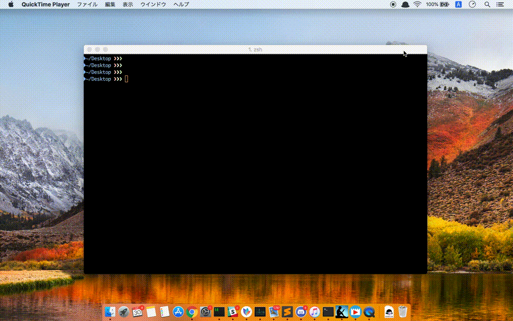

# UnixtimeConverter
Alfread Workflow for instantly converting unixtime into human readable format.

1. install Alfred Workfowa
https://www.alfredapp.com/workflows/

1. git clone this repository 

1. open "UnixtimeConverter.alfredworkflow"

1. type unixtime into alfred starting with "utime"
For example, type 'utime 123456789' and you will find human-readble formatted timestamp on the right top of the screen.

 
